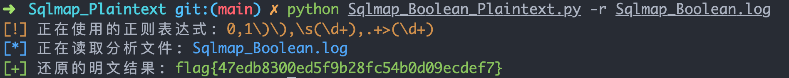
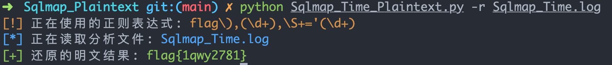

# Sqlmap_Plaintext
Sqlmap 盲注注入日志 Payload 分析转明文脚本，写这个脚本被一些 CTF 题目逼的，发现老是这种蛋疼的题目，虽然日志都可以看懂，但是一个个字母去解密太折腾了，所以这个脚本诞生了。目前遇到的 2 题发现都可以成功解题。

做这种题目的套路就是首先自己从 Wireshark 里面提取出注入的 HTTP 日志，然后整理好，写一个对应的正则规则，最后使用脚本就可以直接解密了。

## 使用运行

脚本使用比较简单，只需要一个 `-r` 参数读取文件即可，然后自己修改脚本里面对应的正则

```bash
python Sqlmap_Boolean_Plaintext.py              
usage: Sqlmap_Boolean_Plaintext.py [-h] [-r READ]

optional arguments:
  -h, --help  show this help message and exit
  -r READ     select sqlmap payload log file
```

## 解密 sqlmap_boolean.log 测试

布尔类型的盲注解密：

```bash
python Sqlmap_Boolean_Plaintext.py -r sqlmap_boolean.log
```

 

## 解密 sqlmap_time.log 测试

延时盲注解密：

```
python Sqlmap_Time_Plaintext.py -r sqlmap_time.log
```

 

实际上这两个脚本是一毛一样的，不一样的地方只是**正则**部分。

