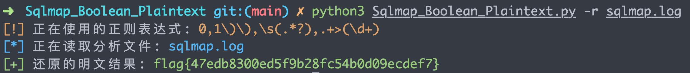
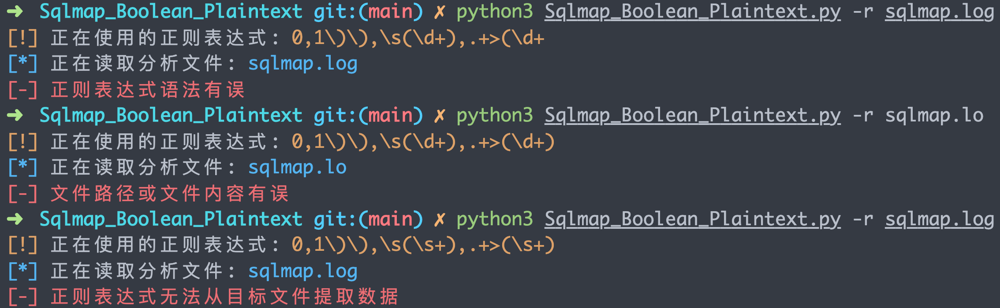

# Sqlmap_Boolean_Plaintext
Sqlmap 布尔注入日志 Payload 分析转明文脚本，写这个脚本是从 sqlmap.pcapng 一道 CTF 题目里面找到的灵感，不确定是否通用，但是实现思路可以参考一下。首先从日志里面提取出注入的顺序和对应的 Ascii 码值，然后分析一下提取出正确的 Ascii 码然后解码即可。

## 使用运行

脚本使用比较简单，只需要一个 `-r` 参数读取文件即可，然后自己修改脚本里面对应的正则

```bash
python Sqlmap_Boolean_Plaintext.py              
usage: Sqlmap_Boolean_Plaintext.py [-h] [-r READ]

optional arguments:
  -h, --help  show this help message and exit
  -r READ     select sqlmap payload log file
```

## 解密 sqlmap.log 测试

```bash
python Sqlmap_Boolean_Plaintext.py -r sqlmap.log
```

  

## 报错异常测试

  

